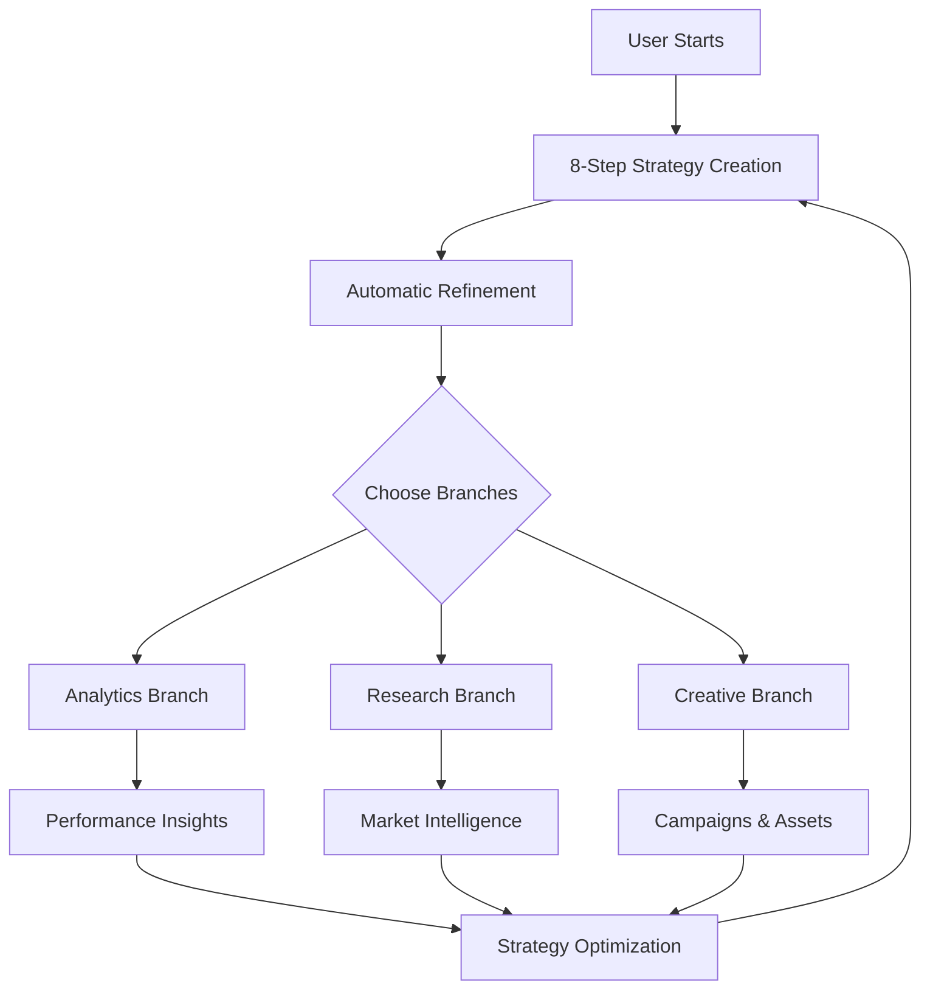
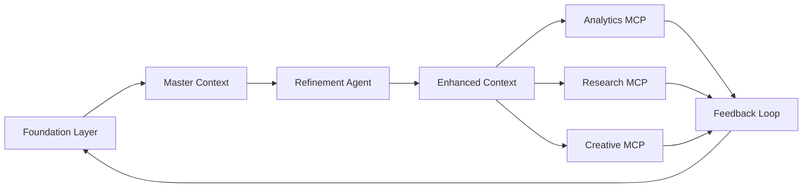

# Product Requirements Document (PRD)

## Growth Strategy Platform v3.0

### AI-Powered Strategic Planning & Execution System

---

## 1. Executive Summary

### Product Vision

Build a comprehensive AI-powered platform that guides businesses through strategic planning and execution by combining an 8-step growth strategy foundation with specialized execution agents powered by Model Context Protocol (MCP) integrations.

### Core Value Proposition

Transform fragmented growth efforts into a unified, data-driven system where strategic planning seamlessly flows into execution, with every action informed by a master strategy context.

### System Architecture Overview

```
                    ┌─────────────────────────────────────┐
                    │                                     │
                    │    🎯 GROWTH STRATEGY FOUNDATION    │
                    │         (8-Step Process)            │
                    │                                     │
                    │  1. GTM Consultant                  │
                    │  2. Persona Strategist              │
                    │  3. Product Manager                 │
                    │  4. Growth Manager                  │
                    │  5. Head of Acquisition             │
                    │  6. Head of Retention               │
                    │  7. Viral Growth Architect          │
                    │  8. Growth Hacker                   │
                    │                                     │
                    │  Output: Master Strategy Context    │
                    └──────────────┬──────────────────────┘
                                   │
                        [Strategy Context Flows Down]
                                   │
                    ┌──────────────▼──────────────────────┐
                    │   STRATEGY REFINEMENT AGENT         │
                    │   (Validates & Optimizes Strategy)  │
                    └──────────────┬──────────────────────┘
                                   │
                ┌──────────────────┼──────────────────────┐
                │                  │                       │
     ┌──────────▼──────────┐ ┌────▼──────────┐ ┌─────────▼──────────┐
     │                     │ │                │ │                    │
     │   📊 ANALYTICS &    │ │  🔍 RESEARCH  │ │  🎨 CREATIVE      │
     │    PERFORMANCE      │ │   & MARKET    │ │    GENERATOR       │
     │                     │ │  INTELLIGENCE │ │                    │
     ├─────────────────────┤ ├────────────────┤ ├────────────────────┤
     │                     │ │                │ │                    │
     │ • Google Analytics  │ │ • Perplexity  │ │ • Brand Strategy   │
     │   MCP               │ │   MCP         │ │   Agent            │
     │ • DataForSEO        │ │ • Competitor  │ │ • Ad Copywriter    │
     │ • Real-time KPIs    │ │   Analyzer    │ │   Agent            │
     │ • Conversion        │ │ • Market      │ │ • Campaign Builder │
     │   Tracking          │ │   Trends      │ │ • DALL-E MCP       │
     │ • Cohort Analysis   │ │ • SEO Intel   │ │ • Creative Assets  │
     │ • A/B Testing       │ │ • Industry    │ │ • Design System    │
     │   Results           │ │   Reports     │ │                    │
     │                     │ │                │ │                    │
     └─────────────────────┘ └────────────────┘ └────────────────────┘
                │                  │                       │
                └──────────────────┼───────────────────────┘
                                   │
                        [Continuous Feedback Loop]
                                   │
                    ┌──────────────▼──────────────────────┐
                    │      STRATEGY OPTIMIZATION          │
                    │   (Iterative Improvement Cycle)     │
                    └─────────────────────────────────────┘
```

### Target Release

- **MVP**: Q2 2025
- **Full Platform**: Q4 2025

---

## 2. Problem Statement

### Current Pain Points

1. **Strategy-Execution Gap**: Companies create strategies that don't translate into tactical execution
2. **Tool Fragmentation**: Marketing teams use 10+ disconnected tools with no unified context
3. **Data Silos**: Analytics, research, and creative teams work in isolation
4. **Manual Workflows**: Repetitive tasks consume 60% of marketing team time
5. **Inconsistent Messaging**: Lack of centralized brand and strategy alignment

### Market Opportunity

- **TAM**: $8.5B (Marketing automation + Strategy consulting)
- **Target Market**: Mid-market B2B SaaS companies ($10M-$100M ARR)
- **Competition Gap**: No existing platform combines strategic planning with AI-powered execution

---

## 3. Goals and Objectives

### Primary Goals

1. **Unify Strategy & Execution**: Create seamless flow from planning to implementation
2. **Automate Intelligence Gathering**: Reduce research time by 80%
3. **Ensure Strategic Alignment**: Every output references master strategy
4. **Enable Parallel Workflows**: Multiple teams working simultaneously with shared context

### Success Criteria

- 100+ companies using platform within 6 months
- 75% reduction in strategy-to-execution time
- 90% user satisfaction score
- 50% reduction in tool switching

### Architectural Principles

- **Hierarchical Dependency**: All execution branches depend on completed strategy
- **Context Inheritance**: Every action inherits and uses strategy context
- **Parallel Execution**: Post-strategy branches run simultaneously
- **Continuous Feedback**: Execution insights refine original strategy

---

## 4. User Personas

### Primary Persona: Growth Marketing Manager "Sarah"

- **Company Size**: 50-500 employees
- **Technical Skill**: Medium
- **Pain Points**: Too many tools, lack of strategic alignment, manual reporting
- **Goal**: Streamline workflows while maintaining strategic consistency
- **Journey**: Complete strategy → Monitor analytics → Refine campaigns

### Secondary Persona: Founder/CEO "David"

- **Company Size**: 10-50 employees
- **Technical Skill**: Low-Medium
- **Pain Points**: No dedicated marketing team, needs guided strategy
- **Goal**: Get professional-level marketing without hiring experts
- **Journey**: Guided strategy creation → Automated execution → Simple monitoring

### Tertiary Persona: Marketing Ops Manager "Alex"

- **Company Size**: 500+ employees
- **Technical Skill**: High
- **Pain Points**: Data integration, cross-team alignment, ROI measurement
- **Goal**: Create scalable, measurable marketing systems
- **Journey**: Strategy validation → System integration → Performance optimization

---

## 5. Product Components (Based on Architecture)

### 5.1 Layer 1: Growth Strategy Foundation (Top Level)

#### Purpose

Create comprehensive growth strategy through sequential AI-guided conversations

#### The 8 Strategic Agents

##### Agent 1: GTM Consultant

- **Objective**: Establish market foundation and business model
- **Key Outputs**:
  - Value proposition canvas
  - Business model canvas
  - Market segmentation
  - Pricing strategy
- **Context Created**: Business foundation for all downstream agents

##### Agent 2: Persona Strategist

- **Objective**: Deep customer psychology and behavioral analysis
- **Key Outputs**:
  - Detailed persona profiles (3-5)
  - Psychographic analysis
  - Journey maps
  - Pain point mapping
- **Context Created**: Customer intelligence for targeting

##### Agent 3: Product Manager

- **Objective**: Product-market fit and brand positioning
- **Key Outputs**:
  - Product positioning statement
  - Brand identity framework
  - Competitive differentiation
  - Feature prioritization
- **Context Created**: Product and brand guidelines

##### Agent 4: Growth Manager

- **Objective**: Metrics framework and funnel design
- **Key Outputs**:
  - North Star metric definition
  - AARRR funnel design
  - KPI framework
  - Dashboard requirements
- **Context Created**: Measurement framework

##### Agent 5: Head of Acquisition

- **Objective**: Customer acquisition strategy
- **Key Outputs**:
  - Channel mix strategy
  - CAC targets by channel
  - Paid/organic balance
  - Content strategy
- **Context Created**: Acquisition playbook

##### Agent 6: Head of Retention

- **Objective**: Lifecycle marketing and engagement
- **Key Outputs**:
  - Retention programs
  - Engagement sequences
  - Churn prevention tactics
  - Loyalty framework
- **Context Created**: Retention strategy

##### Agent 7: Viral Growth Architect

- **Objective**: Growth loops and network effects
- **Key Outputs**:
  - Growth loop designs
  - Viral mechanisms
  - Referral program structure
  - Network effect strategies
- **Context Created**: Viral growth systems

##### Agent 8: Growth Hacker

- **Objective**: Experimentation framework
- **Key Outputs**:
  - Test hypothesis backlog
  - Experiment prioritization
  - A/B testing framework
  - Innovation pipeline
- **Context Created**: Testing methodology

#### Master Strategy Context Output

```json
{
  "version": "1.0",
  "sessionId": "uuid",
  "timestamp": "2025-01-01T00:00:00Z",
  "status": "completed",

  "businessModel": {
    "valueProposition": "...",
    "targetMarket": "...",
    "revenueModel": "...",
    "pricingStrategy": {...}
  },

  "personas": [
    {
      "name": "Enterprise Emma",
      "demographics": {...},
      "psychographics": {...},
      "painPoints": [...],
      "journey": {...}
    }
  ],

  "brandStrategy": {
    "positioning": "...",
    "identity": {...},
    "voice": {...}
  },

  "growthMetrics": {
    "northStar": {...},
    "leading": [...],
    "lagging": [...]
  },

  "channels": {
    "acquisition": [...],
    "retention": [...],
    "referral": [...]
  },

  "growthMechanisms": {
    "loops": [...],
    "networkEffects": [...],
    "viralFactors": [...]
  },

  "experiments": {
    "framework": {...},
    "backlog": [...],
    "priorities": [...]
  }
}
```

### 5.2 Layer 2: Strategy Refinement Agent

#### Purpose

Validate, enhance, and prepare strategy for execution

#### Capabilities

- **Consistency Validation**: Check for conflicts across agent outputs
- **Gap Analysis**: Identify missing elements or opportunities
- **Priority Ranking**: Score and rank initiatives by impact/effort
- **Resource Planning**: Estimate time, budget, and team requirements
- **Risk Assessment**: Identify and mitigate potential failures

#### Output Enhancement

```typescript
interface RefinedStrategy extends MasterStrategy {
  validation: {
    score: number;
    issues: Issue[];
    recommendations: string[];
  };

  priorities: {
    immediate: Initiative[];
    shortTerm: Initiative[];
    longTerm: Initiative[];
  };

  resources: {
    budget: BudgetAllocation;
    team: TeamRequirements;
    tools: ToolRequirements;
  };

  risks: Risk[];
}
```

### 5.3 Layer 3: Parallel Execution Branches

#### Branch 1: Analytics & Performance Monitoring

##### MCP Integrations

- **Google Analytics MCP**
  - Real-time KPI tracking
  - Conversion funnel analysis
  - User behavior tracking
  - Custom event monitoring

- **DataForSEO**
  - Organic performance tracking
  - Keyword ranking monitoring
  - Technical SEO health
  - SERP analysis

##### Custom Analytics Features

- **Strategic Alignment Dashboard**: KPIs mapped to strategy goals
- **Persona Performance**: Metrics segmented by persona
- **Channel Attribution**: ROI by acquisition channel
- **Experiment Tracking**: A/B test results and learnings

##### Output Examples

```typescript
interface AnalyticsOutput {
  kpiStatus: {
    northStar: MetricStatus;
    leading: MetricStatus[];
    health: HealthScore;
  };

  insights: {
    trends: Trend[];
    anomalies: Anomaly[];
    opportunities: Opportunity[];
  };

  recommendations: {
    immediate: Action[];
    strategic: StrategyAdjustment[];
  };
}
```

#### Branch 2: Research & Market Intelligence

##### MCP Integrations

- **Perplexity MCP**
  - Market trend analysis
  - Industry news monitoring
  - Technology tracking
  - Regulatory updates

- **Competitor Analysis Tools**
  - DataForSEO competitor module
  - Ahrefs MCP (when available)
  - Social listening APIs

##### Research Capabilities

- **Competitor Monitoring**: Track competitor moves aligned to positioning
- **Market Trends**: Identify trends relevant to target personas
- **Content Gaps**: Find opportunities based on value proposition
- **Industry Intelligence**: Regulatory and technology changes

##### Output Structure

```typescript
interface ResearchOutput {
  competitors: {
    movements: CompetitorAction[];
    strengths: Analysis;
    weaknesses: Analysis;
    opportunities: Opportunity[];
  };

  market: {
    trends: Trend[];
    emerging: EmergingTech[];
    threats: Threat[];
  };

  content: {
    gaps: ContentGap[];
    opportunities: ContentIdea[];
    keywords: KeywordCluster[];
  };
}
```

#### Branch 3: Creative Generator

##### Components

###### Brand Strategy Agent

- **Input**: Value proposition, positioning, personas
- **Process**: Generate comprehensive brand guidelines
- **Output**: Brand book, voice guide, visual identity

###### Ad Copywriter Agent

- **Input**: Personas, value prop, channels
- **Process**: Generate copy variants per persona/channel
- **Output**: Headlines, ad copy, email templates, social posts

###### Campaign Builder

- **Input**: Strategy, channels, budget
- **Process**: Design integrated campaigns
- **Output**: Campaign briefs, timelines, asset requirements

##### MCP Integrations

- **DALL-E MCP**: Visual asset generation
- **MiniMax MCP**: Video/audio content
- **Stable Diffusion MCP**: Advanced image generation

##### Creative Outputs

```typescript
interface CreativeOutput {
  brand: {
    guidelines: BrandGuidelines;
    voiceAndTone: VoiceGuide;
    visualIdentity: DesignSystem;
  };

  campaigns: {
    plans: CampaignPlan[];
    briefs: CreativeBrief[];
    assets: AssetLibrary;
  };

  copy: {
    headlines: HeadlineBank;
    adCopy: AdVariations;
    emails: EmailTemplates;
    social: SocialContent;
  };
}
```

---

## 6. Feature Requirements

### 6.1 Core Features (MVP)

#### F1: 8-Step Strategy Creation

```yaml
requirement:
  priority: P0
  description: 'Sequential strategy creation through 8 agents'
  user_story: 'As a user, I want to create a comprehensive strategy through guided conversations'

  acceptance_criteria:
    - Sequential flow through all 8 agents
    - Context passing between agents
    - Save/resume capability at any step
    - Export complete strategy
    - Time estimate: 2-4 hours total

  technical_specs:
    - Cloudflare Workers for each agent
    - KV storage for session persistence
    - WebSocket for real-time chat
    - Context validation between steps
```

#### F2: Strategy Refinement Layer

```yaml
requirement:
  priority: P0
  description: 'Automatic strategy validation and enhancement'
  user_story: 'As a user, I want my strategy validated and optimized before execution'

  acceptance_criteria:
    - Automatic trigger after 8-step completion
    - Identify gaps and conflicts
    - Provide improvement suggestions
    - Generate priority ranking
    - 30-minute processing time

  technical_specs:
    - Dedicated refinement agent
    - Rule-based validation engine
    - ML-powered optimization suggestions
```

#### F3: Analytics Branch Activation

```yaml
requirement:
  priority: P0
  description: 'Connect analytics tools with strategy context'
  user_story: 'As a user, I want to track KPIs aligned to my strategy'

  acceptance_criteria:
    - Connect Google Analytics via MCP
    - Auto-configure dashboards from strategy
    - Track North Star metric
    - Generate weekly reports

  technical_specs:
    - Google Analytics MCP integration
    - Custom dashboard generator
    - Automated report builder
```

### 6.2 Advanced Features (Post-MVP)

#### F4: Research Branch Activation

```yaml
requirement:
  priority: P1
  description: 'Automated market and competitor intelligence'
  user_story: 'As a user, I want continuous market insights relevant to my strategy'

  acceptance_criteria:
    - Competitor tracking based on positioning
    - Trend analysis for target personas
    - Weekly intelligence reports
    - Content gap identification
```

#### F5: Creative Branch Activation

```yaml
requirement:
  priority: P1
  description: 'AI-powered creative generation aligned to strategy'
  user_story: 'As a user, I want to generate campaigns and assets that match my strategy'

  acceptance_criteria:
    - Brand guide generation
    - Campaign planning tools
    - Copy generation per persona
    - Visual asset creation
```

#### F6: Multi-User Collaboration

```yaml
requirement:
  priority: P2
  description: 'Team collaboration on strategies and execution'
  user_story: 'As a team lead, I want my team to collaborate on our strategy'

  acceptance_criteria:
    - Role-based access control
    - Real-time collaboration
    - Comments and annotations
    - Approval workflows
```

#### F7: Custom Agent Builder

```yaml
requirement:
  priority: P3
  description: 'Create custom agents for specific needs'
  user_story: 'As a power user, I want to create custom agents for my industry'

  acceptance_criteria:
    - Visual agent designer
    - Custom prompt templates
    - MCP server integration
    - Agent marketplace
```

---

## 7. Technical Architecture

### 7.1 Technology Stack

```yaml
frontend:
  framework: React 18 + TypeScript
  styling: TailwindCSS
  state: Zustand
  routing: React Router v6
  build: Vite
  deployment: Cloudflare Pages

backend:
  runtime: Cloudflare Workers
  framework: Hono
  language: TypeScript
  ai: Anthropic Claude API (Opus 4.1)
  deployment: Wrangler

storage:
  primary: Cloudflare KV
  sessions: Durable Objects
  analytics: PostgreSQL (Supabase)
  files: Cloudflare R2
  cache: Cloudflare Cache API

integrations:
  mcp_servers:
    foundation:
      - 'None (custom agents)'
    analytics:
      - 'Google Analytics MCP'
      - 'DataForSEO MCP'
      - 'Mixpanel MCP (future)'
    research:
      - 'Perplexity MCP'
      - 'DataForSEO Competitor'
      - 'Ahrefs MCP (future)'
    creative:
      - 'DALL-E MCP'
      - 'MiniMax MCP'
      - 'Stable Diffusion MCP'
    crm:
      - 'HubSpot MCP'
      - 'Salesforce (via Coupler.io)'

authentication:
  provider: Supabase Auth
  methods:
    - Email/Password
    - Google OAuth
    - Microsoft OAuth (enterprise)
```

### 7.2 Data Models

```typescript
// Core Strategy Data Structure
interface StrategySession {
  id: string;
  userId: string;
  organizationId?: string;
  status: 'in_progress' | 'completed' | 'refined' | 'active';

  // 8-Step Agent Outputs
  agents: {
    gtmConsultant: {
      completed: boolean;
      output: GTMOutput;
      timestamp: Date;
      duration: number;
    };
    personaStrategist: {
      completed: boolean;
      output: PersonaOutput;
      timestamp: Date;
      duration: number;
    };
    // ... other 6 agents
  };

  // Combined Context
  masterContext: MasterContext;

  // Refinement Layer
  refinement?: {
    timestamp: Date;
    validation: ValidationResult;
    enhancements: Enhancement[];
    priorities: PriorityList;
  };

  // Execution Branches Status
  branches: {
    analytics: {
      enabled: boolean;
      lastSync: Date;
      config: AnalyticsConfig;
    };
    research: {
      enabled: boolean;
      lastRun: Date;
      config: ResearchConfig;
    };
    creative: {
      enabled: boolean;
      assets: number;
      config: CreativeConfig;
    };
  };

  metadata: {
    createdAt: Date;
    updatedAt: Date;
    lastAccessed: Date;
    version: string;
  };
}

// Master Context Structure (Foundation Output)
interface MasterContext {
  // Business Foundation (GTM Consultant)
  businessModel: {
    valueProposition: ValueProp;
    revenueStreams: RevenueStream[];
    costStructure: CostStructure;
    businessCanvas: BusinessModelCanvas;
  };

  // Customer Intelligence (Persona Strategist)
  personas: {
    primary: Persona;
    secondary: Persona[];
    journeyMaps: JourneyMap[];
    psychographics: PsychographicProfile[];
  };

  // Product & Brand (Product Manager)
  productStrategy: {
    positioning: PositioningStatement;
    brandIdentity: BrandIdentity;
    competitiveDiff: Differentiator[];
    productRoadmap: Roadmap;
  };

  // Growth Framework (Growth Manager)
  metrics: {
    northStar: NorthStarMetric;
    leading: Metric[];
    lagging: Metric[];
    funnel: AARRRFunnel;
  };

  // Acquisition Strategy (Head of Acquisition)
  acquisition: {
    channels: Channel[];
    budget: BudgetAllocation;
    content: ContentStrategy;
    campaigns: CampaignPlan[];
  };

  // Retention Strategy (Head of Retention)
  retention: {
    programs: RetentionProgram[];
    lifecycle: LifecycleStages;
    engagement: EngagementStrategy;
    churn: ChurnPrevention;
  };

  // Growth Mechanisms (Viral Growth Architect)
  growthLoops: {
    primary: GrowthLoop;
    secondary: GrowthLoop[];
    networkEffects: NetworkEffect[];
    viralFactors: ViralFactor[];
  };

  // Experimentation (Growth Hacker)
  experiments: {
    framework: ExperimentFramework;
    backlog: Hypothesis[];
    priorities: TestPriority[];
    results: ExperimentResult[];
  };
}

// Execution Branch Models
interface ExecutionBranch {
  id: string;
  sessionId: string;
  type: 'analytics' | 'research' | 'creative';

  config: {
    mcpServers: MCPServerConfig[];
    customAgents: AgentConfig[];
    updateFrequency: string;
  };

  outputs: {
    reports: Report[];
    insights: Insight[];
    recommendations: Recommendation[];
  };

  performance: {
    lastRun: Date;
    nextRun: Date;
    successRate: number;
    errors: Error[];
  };
}
```

### 7.3 API Design

```typescript
// RESTful API Endpoints
interface APIEndpoints {
  // Foundation Layer (8-Step Strategy)
  'POST /api/strategy/start': StartStrategySession;
  'GET /api/strategy/:id': GetStrategySession;
  'PUT /api/strategy/:id/agent/:agentName': UpdateAgentOutput;
  'POST /api/strategy/:id/agent/:agentName/complete': CompleteAgent;
  'POST /api/strategy/:id/complete': CompleteFullStrategy;
  'GET /api/strategy/:id/context': GetMasterContext;
  'GET /api/strategy/:id/export': ExportStrategy;

  // Refinement Layer
  'POST /api/strategy/:id/refine': RefineStrategy;
  'GET /api/strategy/:id/refinement': GetRefinementResults;
  'POST /api/strategy/:id/refinement/accept': AcceptRefinements;

  // Analytics Branch
  'POST /api/branches/analytics/connect': ConnectAnalytics;
  'GET /api/branches/analytics/:sessionId/dashboard': GetDashboard;
  'GET /api/branches/analytics/:sessionId/report': GetReport;
  'POST /api/branches/analytics/:sessionId/track': TrackCustomEvent;

  // Research Branch
  'POST /api/branches/research/start': StartResearch;
  'GET /api/branches/research/:sessionId/competitors': GetCompetitors;
  'GET /api/branches/research/:sessionId/trends': GetTrends;
  'GET /api/branches/research/:sessionId/gaps': GetContentGaps;

  // Creative Branch
  'POST /api/branches/creative/generate/brand': GenerateBrand;
  'POST /api/branches/creative/generate/campaign': GenerateCampaign;
  'POST /api/branches/creative/generate/copy': GenerateCopy;
  'POST /api/branches/creative/generate/asset': GenerateAsset;

  // MCP Gateway
  'POST /api/mcp/:server/connect': ConnectMCPServer;
  'POST /api/mcp/:server/tool/:tool': ExecuteMCPTool;
  'GET /api/mcp/servers': ListAvailableServers;
  'GET /api/mcp/:server/status': GetServerStatus;

  // Context Management
  'GET /api/context/:sessionId': GetFullContext;
  'POST /api/context/:sessionId/validate': ValidateContext;
  'PUT /api/context/:sessionId/update': UpdateContext;

  // Feedback Loop
  'POST /api/optimization/insights': SubmitInsights;
  'GET /api/optimization/:sessionId/suggestions': GetOptimizations;
  'POST /api/optimization/:sessionId/apply': ApplyOptimizations;
}
```

### 7.4 System Flow Diagrams

#### User Journey Flow



#### Data Flow Architecture



---

## 8. Success Metrics

### 8.1 Product Metrics

#### Foundation Layer Metrics

- **Completion Rate**: % of users completing all 8 steps
- **Time to Complete**: Average time for full strategy (target: 2-4 hours)
- **Resume Rate**: % of users who resume after stopping
- **Export Rate**: % of users exporting their strategy

#### Execution Branch Metrics

- **Branch Activation**: % of users activating each branch
- **Analytics Usage**: Daily active users in analytics
- **Research Usage**: Weekly research reports generated
- **Creative Usage**: Assets generated per user per month

#### Platform Health Metrics

- **User Retention**: 30-day, 60-day, 90-day retention
- **Feature Adoption**: Time to first branch activation
- **Cross-Branch Usage**: % using multiple branches
- **Feedback Loop**: % applying optimizations

### 8.2 Business Metrics

- **MRR Growth**: Month-over-month revenue growth
- **CAC**: Customer acquisition cost by channel
- **LTV**: Customer lifetime value by segment
- **NPS**: Net promoter score (target: 50+)
- **Churn**: Monthly churn rate (target: <5%)

### 8.3 Technical Metrics

- **API Performance**: P50, P95, P99 latency
- **Error Rate**: API error rate (target: <0.1%)
- **MCP Success**: MCP call success rate (target: >99%)
- **Token Usage**: AI tokens per user per month
- **Uptime**: System availability (target: 99.9%)

---

## 9. Development Roadmap

### Phase 1: Foundation (Months 1-2)

**Goal**: Complete 8-step strategy system

- [ ] Week 1-2: GTM Consultant & Persona Strategist agents
- [ ] Week 3-4: Product Manager & Growth Manager agents
- [ ] Week 5-6: Acquisition & Retention Head agents
- [ ] Week 7-8: Viral Architect & Growth Hacker agents
- [ ] Integration: Context passing and session management
- [ ] Testing: End-to-end strategy creation flow

### Phase 2: Refinement Layer (Month 3)

**Goal**: Add strategy validation and enhancement

- [ ] Week 1: Validation engine development
- [ ] Week 2: Gap analysis algorithms
- [ ] Week 3: Priority ranking system
- [ ] Week 4: Testing and optimization

### Phase 3: Analytics Branch (Month 4)

**Goal**: Connect analytics with strategy context

- [ ] Week 1: Google Analytics MCP integration
- [ ] Week 2: Dashboard generator
- [ ] Week 3: Automated reporting
- [ ] Week 4: Performance tracking

### Phase 4: Research Branch (Month 5)

**Goal**: Automated market intelligence

- [ ] Week 1: Perplexity MCP integration
- [ ] Week 2: Competitor analysis tools
- [ ] Week 3: Trend detection algorithms
- [ ] Week 4: Intelligence reporting

### Phase 5: Creative Branch (Month 6)

**Goal**: AI-powered creative generation

- [ ] Week 1: Brand strategy agent
- [ ] Week 2: Copywriter agent
- [ ] Week 3: DALL-E/MiniMax integration
- [ ] Week 4: Campaign builder

### Phase 6: Optimization (Months 7-8)

**Goal**: Feedback loops and improvements

- [ ] Month 7: Feedback collection system
- [ ] Month 7: Strategy optimization engine
- [ ] Month 8: Multi-user collaboration
- [ ] Month 8: Performance optimization

---

## 10. Risks and Mitigations

### Technical Risks

| Risk                         | Impact | Probability | Mitigation                                           |
| ---------------------------- | ------ | ----------- | ---------------------------------------------------- |
| MCP server downtime          | High   | Medium      | Implement fallbacks, retry logic, caching            |
| AI token costs exceed budget | High   | High        | Usage limits, tier-based pricing, token optimization |
| Context size limitations     | Medium | Medium      | Context compression, selective loading, chunking     |
| Integration complexity       | High   | Medium      | Phased rollout, extensive testing, monitoring        |
| Scalability issues           | High   | Low         | Cloudflare Workers auto-scaling, edge deployment     |

### Business Risks

| Risk                        | Impact | Probability | Mitigation                                        |
| --------------------------- | ------ | ----------- | ------------------------------------------------- |
| Low user adoption           | High   | Medium      | Free tier, onboarding program, templates          |
| Competition from incumbents | Medium | High        | Unique strategy-first approach, fast iteration    |
| Pricing resistance          | Medium | Medium      | Value-based pricing, ROI calculator, case studies |
| Strategy quality concerns   | High   | Low         | Expert review, continuous improvement, guarantees |

### Security Risks

| Risk                    | Impact | Probability | Mitigation                                   |
| ----------------------- | ------ | ----------- | -------------------------------------------- |
| Data breach             | High   | Low         | Encryption, access controls, security audits |
| Strategy IP theft       | High   | Low         | Legal protections, watermarking, audit logs  |
| MCP credential exposure | Medium | Low         | Secure credential storage, rotation policies |

---

## 11. Implementation Guidelines

### For Claude/Claude Code Development

#### Development Principles

```markdown
1. **Strategy First**: Every feature must reference the master context
2. **Type Safety**: Use TypeScript for all code
3. **Error Handling**: Comprehensive error handling for all MCP calls
4. **Testing**: Unit, integration, and E2E tests required
5. **Documentation**: Inline comments and API documentation
6. **Monitoring**: Telemetry and logging from day one
```

#### Implementation Order

```markdown
Priority 1: Foundation Layer

- Reuse existing 8-agent system
- Add context export functionality
- Implement session persistence

Priority 2: Context Management

- Create unified context structure
- Build validation system
- Implement context versioning

Priority 3: MCP Gateway

- Create abstraction layer
- Implement connection management
- Add retry and fallback logic

Priority 4: Analytics Branch

- Integrate Google Analytics MCP
- Build dashboard generator
- Create report templates

Priority 5: Research Branch

- Integrate Perplexity MCP
- Build competitor tracker
- Create trend analyzer

Priority 6: Creative Branch

- Build brand agent
- Integrate DALL-E MCP
- Create campaign templates
```

#### Code Structure

```
/apps
  /web                    # React frontend
  /workers               # Cloudflare Workers
    /agents              # 8 foundation agents
    /refinement         # Refinement agent
    /branches           # Execution branches
      /analytics
      /research
      /creative
    /mcp-gateway        # MCP integration layer

/packages
  /shared              # Shared types and utils
  /context            # Context management
  /mcp-client         # MCP client library

/infrastructure
  /cloudflare         # Worker configs
  /supabase          # Database schema
```

### Testing Strategy

#### Test Coverage Requirements

- Unit Tests: 80% coverage minimum
- Integration Tests: All API endpoints
- E2E Tests: Critical user journeys
- Load Tests: 1000 concurrent users
- MCP Tests: Mock servers for development

#### Test Scenarios

```typescript
describe('Strategy Creation', () => {
  test('Complete 8-step flow');
  test('Resume interrupted session');
  test('Context passing between agents');
  test('Export strategy');
});

describe('Execution Branches', () => {
  test('Analytics branch with strategy context');
  test('Research branch with persona filtering');
  test('Creative branch with brand guidelines');
});

describe('MCP Integration', () => {
  test('Connection handling');
  test('Retry logic');
  test('Fallback behavior');
  test('Context injection');
});
```

---

## 12. Appendices

### Appendix A: MCP Server Documentation

#### Available MCP Servers

- [Google Analytics MCP](https://github.com/googleanalytics/google-analytics-mcp)
- [DataForSEO MCP](https://dataforseo.com/mcp)
- [Perplexity MCP](https://perplexity.ai/mcp)
- [DALL-E MCP](https://openai.com/mcp)
- [HubSpot MCP](https://developers.hubspot.com/mcp)

#### MCP Protocol Documentation

- [Model Context Protocol Spec](https://modelcontextprotocol.io)
- [MCP Servers Repository](https://github.com/modelcontextprotocol/servers)
- [MCP Implementation Guide](https://docs.mcp.io)

### Appendix B: Competitive Analysis

| Competitor | Strengths                        | Weaknesses                   | Our Advantage           |
| ---------- | -------------------------------- | ---------------------------- | ----------------------- |
| HubSpot    | Large ecosystem, CRM integration | No strategy layer, expensive | Strategy-first approach |
| Marketo    | Enterprise features              | Complex, no AI agents        | AI-powered simplicity   |
| Jasper     | Good AI writing                  | Content-only, no strategy    | Full-stack solution     |
| Copy.ai    | Easy to use                      | Limited scope                | Comprehensive platform  |

### Appendix C: Sample Outputs

#### Sample Master Context (Truncated)

```json
{
  "version": "1.0",
  "sessionId": "550e8400-e29b-41d4-a716-446655440000",
  "businessModel": {
    "valueProposition": "AI-powered growth strategy platform that bridges the gap between planning and execution",
    "targetMarket": "B2B SaaS companies $10M-$100M ARR",
    "revenueModel": "SaaS subscription with usage-based pricing"
  },
  "personas": [
    {
      "name": "Growth Manager Sarah",
      "role": "Head of Growth",
      "company_size": "50-500 employees",
      "pain_points": [
        "Too many disconnected tools",
        "Strategy doesn't translate to tactics",
        "Manual reporting takes hours"
      ],
      "goals": [
        "Streamline marketing operations",
        "Prove ROI of initiatives",
        "Scale growth predictably"
      ]
    }
  ],
  "metrics": {
    "northStar": {
      "name": "Weekly Active Users",
      "current": 1000,
      "target": 10000,
      "timeline": "12 months"
    }
  }
}
```

#### Sample Analytics Output

```json
{
  "period": "2025-01-01 to 2025-01-31",
  "performance": {
    "northStar": {
      "value": 1250,
      "change": "+25%",
      "trend": "increasing",
      "vs_target": "on_track"
    },
    "acquisition": {
      "new_users": 500,
      "channels": {
        "organic": 200,
        "paid": 150,
        "referral": 100,
        "direct": 50
      }
    }
  },
  "insights": [
    "Referral channel outperforming expectations by 50%",
    "Mobile conversion rate 30% lower than desktop",
    "Persona 'Enterprise Emma' has highest LTV"
  ],
  "recommendations": [
    "Increase referral program investment",
    "Optimize mobile experience",
    "Create more Enterprise-focused content"
  ]
}
```

---

## 13. Glossary

| Term                    | Definition                                                |
| ----------------------- | --------------------------------------------------------- |
| **MCP**                 | Model Context Protocol - Standard for AI tool integration |
| **Master Context**      | Combined output from all 8 strategy agents                |
| **Foundation Layer**    | The 8-step strategy creation process                      |
| **Execution Branch**    | Parallel workstreams (Analytics, Research, Creative)      |
| **North Star Metric**   | Single metric that best captures core value               |
| **Growth Loop**         | Self-reinforcing cycle that drives growth                 |
| **Context Inheritance** | Passing strategy data to all downstream processes         |

---

## 14. Version History

| Version | Date       | Changes             | Author       |
| ------- | ---------- | ------------------- | ------------ |
| 1.0     | 2025-01-15 | Initial PRD         | AI Assistant |
| 1.1     | TBD        | Post-review updates | TBD          |

---

## 15. Sign-off

### Stakeholder Approval

- [ ] Product Owner
- [ ] Engineering Lead
- [ ] Design Lead
- [ ] Marketing Lead
- [ ] CEO/Founder

### Review Checklist

- [x] Architecture diagram integrated
- [x] All 8 agents documented
- [x] Execution branches defined
- [x] Technical specifications complete
- [x] Implementation guidelines provided
- [x] Risk assessment complete
- [x] Success metrics defined
- [x] Roadmap established

---

**Document Status**: READY FOR REVIEW  
**Next Steps**: Engineering feasibility review  
**Target Start Date**: Q1 2025

---

_This PRD serves as the comprehensive blueprint for building the Growth Strategy Platform v3.0. The hierarchical architecture ensures that strategic planning flows seamlessly into execution, with every action informed by the master strategy context._
